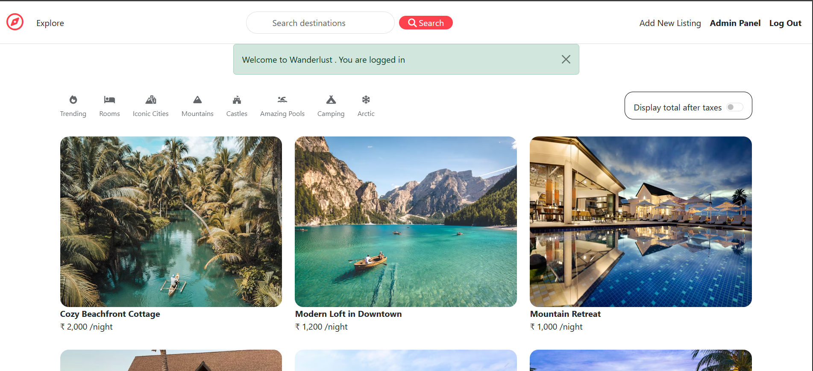
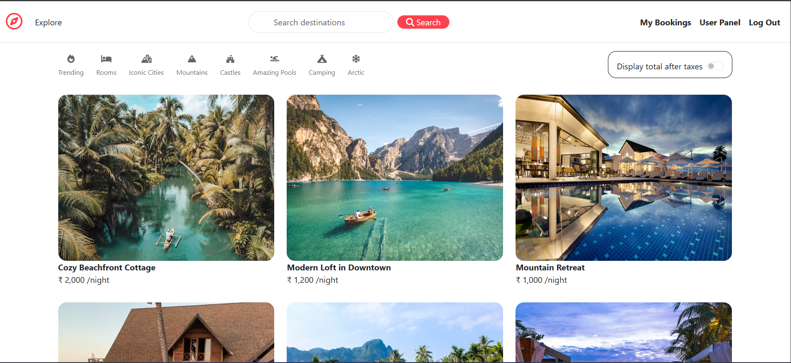
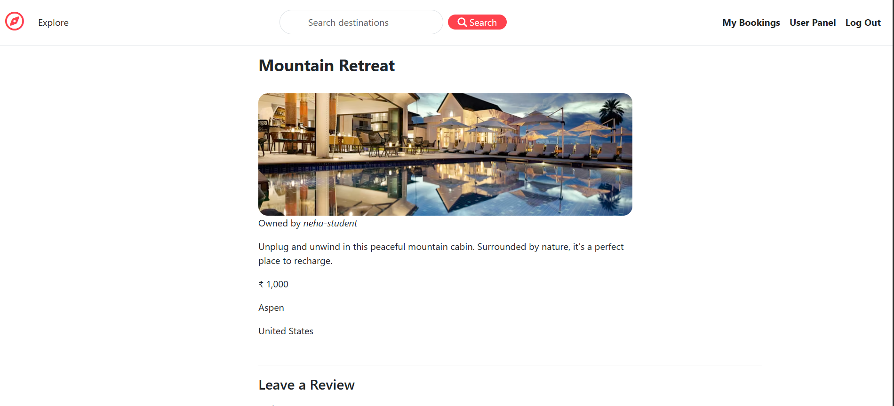
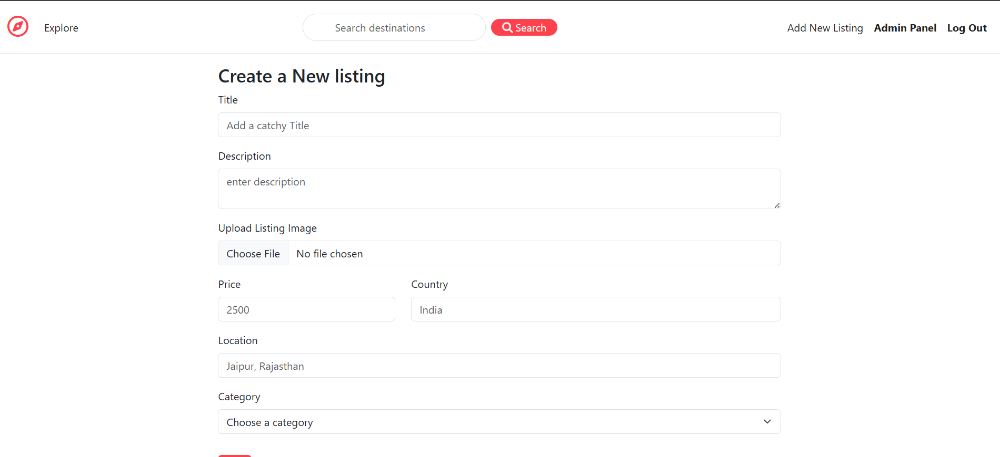
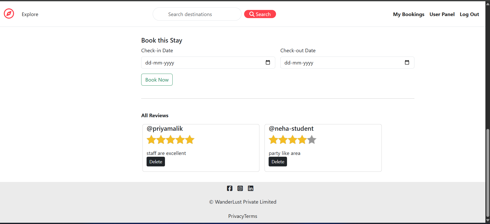

# 🏨 Wanderlust - Hotel Booking Web Application

Wanderlust is a modern hotel and property booking platform built using the **MERN-like stack (MongoDB, Express, EJS, Node.js)**. It allows users to browse listings, filter by categories and book stays. Admins can manage listings while users can view dashboards and bookings.

---


## 🌐 Features

### 👥 Role-Based Access
- **Admin**: Can create, edit, and delete listings.
- **User**: Can view listings, make bookings, view booking history.

### 🧾 Listings & Categories
- Add listings with image, price, location, etc.
- Filter listings by categories:
  - Trending
  - Rooms
  - Iconic Cities
  - Castles
  - Mountains
  - Camping
  - Arctic, etc.

### 🔍 Search Functionality
- Responsive **search bar** integrated in navbar.
- Search based on city or listing title.

### 📆 Booking System
- Logged-in users can select check-in/check-out dates and book stays.
- Admin cannot book.

### 🛡️ Authentication & Authorization
- Signup/Login via Passport.js
- Sessions maintained via `express-session`
- Role assigned on signup (`admin` or `user`)

### 📱 Responsive Design
- Fully responsive UI using **Bootstrap 5**
- Optimized for mobile, tablet, and desktop

---

## 🔧 Tech Stack

| Technology       | Role                                |
|------------------|-------------------------------------|
| **Node.js**       | Backend server                     |
| **Express.js**    | Routing and middleware             |
| **MongoDB**       | Database for listings and bookings |
| **Mongoose**      | MongoDB ODM                        |
| **EJS**           | Templating engine                  |
| **Bootstrap 5**   | Responsive frontend styling        |  
| **Passport.js**   | User Authentication                |
| **Connect-Flash** | Flash message handling             |

---

## 🚀 Getting Started (for Developers)

1. Clone this repository:
   ```bash
   git clone https://github.com/NancyGoyal06/Wanderlust_project.git
   cd Wanderlust_project

2. **Install dependencies:**
   ```bash
   npm install
   ```
2. **Setup .env :**
   ```env
   SECRET=your_session_secret
   RAZORPAY_KEY_ID=rzp_test_XXXXXXXX
   RAZORPAY_SECRET=your_razorpay_secret
   ```

4. **Start the server:**
   ```bash
   npm app.js
   ```

5. **Open your browser and go to:**
   ```
   http://localhost:8080
   ```

---

## Screenshots












---


## 🤝 Contributions

Feel free to fork this repo and submit a pull request. Contributions are welcome!

---

## Authors

- [@NancyGoyal06](https://www.github.com/NancyGoyal06)